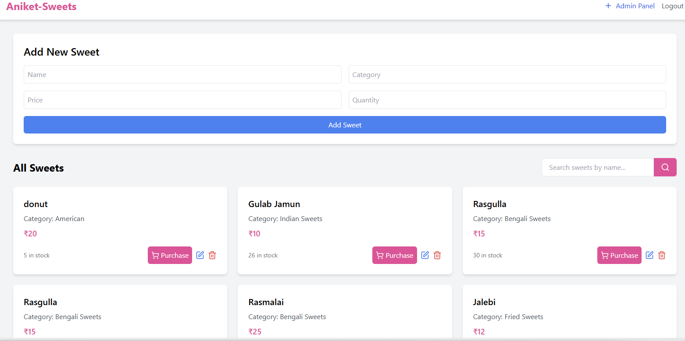
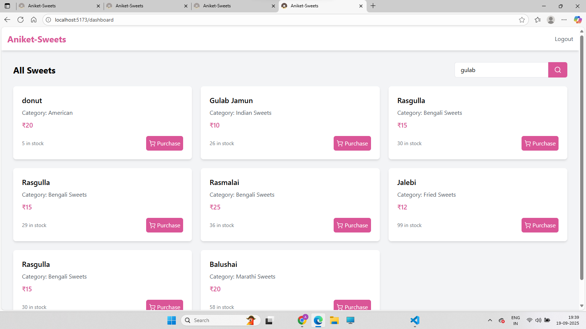

# Sweet Shop Management System

**Admin Username**: aniket@example.com
 **Admin password**: password123
 
### Project Overview
The Sweet Shop Management System is a full-stack application designed to manage the inventory and sales of a sweet shop. The project includes a robust RESTful API built with Node.js and a modern, interactive frontend built with React. It features a complete user authentication system and a dashboard for managing sweet inventory, with restricted access for administrative tasks.

### Core Features
- **User Authentication**: Secure user registration and login with JSON Web Tokens (JWT).
- **Sweets Management**:
    - View a list of all available sweets on a public dashboard.
    - Search and filter sweets dynamically by name, category, or price range.
- **Admin Management**:
    - 
    - A dedicated admin panel (conditionally rendered) with forms to add new sweets.
    - Functionality to edit a sweet's details (name, category, price, quantity).
    - An admin-only feature to delete a sweet with a confirmation prompt.
- **Inventory Control**:
    - A "Purchase" button for all users to buy a sweet, which decrements the stock quantity.
    - A "Restock" button for admin users to add more stock to a sweet's inventory.

### Technology Stack

#### Backend
- **Framework**: Express.js
- **Database**: MongoDB
- **Authentication**: JWT, bcryptjs
 **Testing**: thunder client

#### Frontend
- **Framework**: React.js
- **UI Styling**: Tailwind CSS
- **Routing**: React Router
- **State Management**: React Hooks (useState, useEffect, useNavigate)
- **API Calls**: Axios
-

### Getting Started

#### Prerequisites
- Node.js (version 20 or higher) and npm.
- A running MongoDB instance (local or remote).
- An `.env` file in the `backend` directory with your database connection string and a JWT secret.
    ```
    MONGO_URI=mongodb://127.0.0.1:27017/sweet-shop-db
    JWT_SECRET=your_super_secret_key
    ```


#### Backend Setup
1.  Navigate to the `backend` directory.
2.  Install dependencies: `npm install`
3.  Start the development server: `npm run dev`
4.  The API will be running at `http://localhost:5001`.

#### Frontend Setup
1.  Navigate to the `frontend` directory.
2.  Install dependencies: `npm install`
3.  Start the development server: `npm run dev`
4.  The application will be running at `http://localhost:5173`.
5.  

### My AI Usage
I used an AI assistant extensively throughout this project. It served as a key partner in the TDD workflow, helping me to:
- **Scaffold the project**: Generate the initial boilerplate for the Express API and the React frontend, including dependencies and configuration files.
- **Write and debug code**: Provide structured, clean code for controller functions, API services, and React components. It was instrumental in debugging complex issues like the module system mismatch and resolving the `404 Not Found` and re-rendering bugs in the frontend.
- **Formulate commit messages**: Craft formal and easy-to-understand commit messages that accurately document the TDD process and adhere to the AI co-authorship policy.

The AI assistant significantly improved my workflow by accelerating boilerplate generation, providing on-demand debugging assistance, and helping me maintain a clear and consistent development process.

